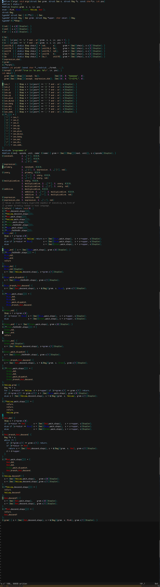

### Grammar Machine: Two Poles of Programming

## Problem

A tree does not grow without roots.

In most machine languages, the control flow of *language rules*
(grammar, interpretation) is entangled with the control flow of *actions*
(effects, execution).

As languages evolve, this entanglement grows:
small and cute at first,
then expanded into incidental state and committee-approved control flow,
owned by a few.

The reason is simple:
the evolution of roots (rules) and actions is coupled.

## Road to a Solution

This repository shows how to divide control flow at the level of a **Step**.

It demonstrates:

* how to represent a *two-meaning step*
* how to write continuations explicitly
* how to compose rules and actions without entangling them

## Definitions

A **Step** is the fundamental unit of composition.

Most instructions—`add`, `sub`, `mul`—are single-meaning Steps.

`div`, however, is different.

Division defines **two meanings**:

* a normal value continuation
* a division-by-zero continuation

This choice is not external.
It is defined *within the Step itself*.

An **ambiguous Step** (ორაზროვანი ნაბიჯი) is a Step that explicitly defines
multiple admissible continuations.

Ambiguity is not an error.
It is structure.

## Combinatorics

We use layered Step combinatorics:

* **two-step** combinatorics to define language rules
* **three-step** combinatorics to define actions inside rules
* a **four-step choice machine** to compose both

A two-meaning Step is fully composable.
It is the primary tool for dividing power:
allowing rule control flow and action control flow
to evolve in polar spaces.

## Choice Machine

The algorithm handles any grammar,
including direct and indirect left recursion.

Left recursion becomes tail recursion by construction.

